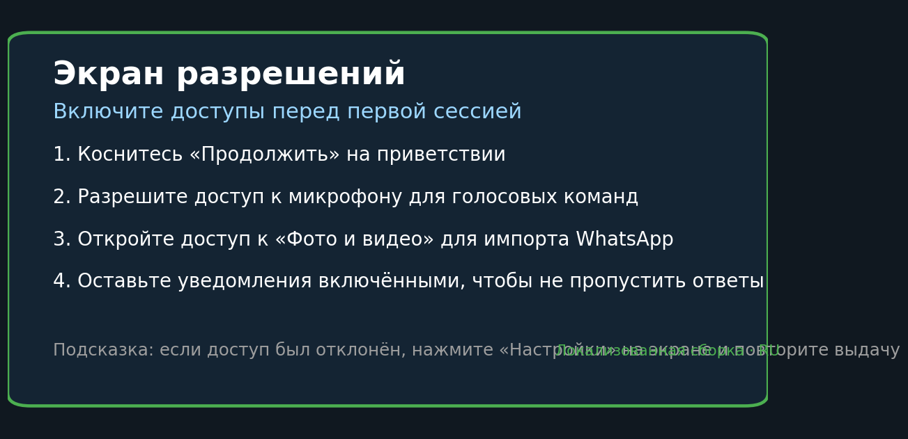
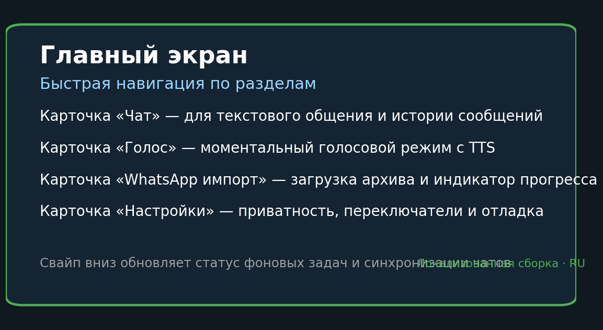
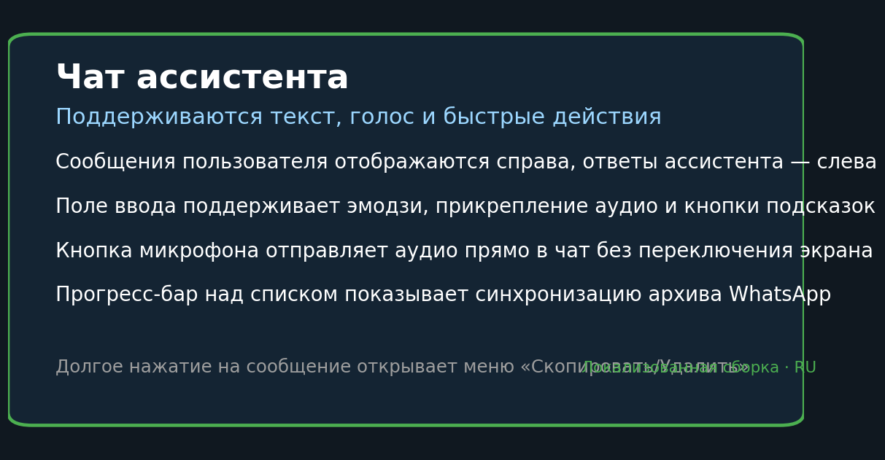
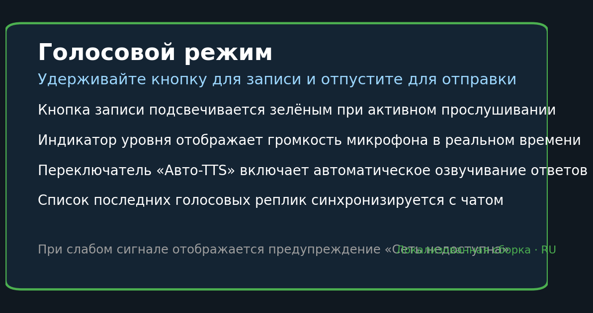
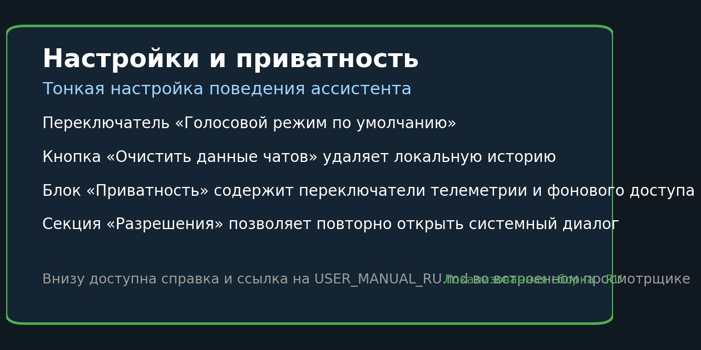

# Руководство пользователя Asis Virtual Companion (RU)

## Содержание
- [Введение](#введение)
- [Установка и первый запуск](#установка-и-первый-запуск)
- [Выдача разрешений](#выдача-разрешений)
- [Главный экран и навигация](#главный-экран-и-навигация)
- [Чат](#чат)
- [Голосовой режим](#голосовой-режим)
- [Импорт переписок WhatsApp](#импорт-переписок-whatsapp)
- [Настройки и приватность](#настройки-и-приватность)
- [Советы и рекомендации](#советы-и-рекомендации)
- [FAQ](#faq)
- [Диагностика и устранение неполадок](#диагностика-и-устранение-неполадок)

## Введение
Asis Virtual Companion — локальный виртуальный собеседник с поддержкой текстовых и голосовых диалогов, импортом переписок WhatsApp и расширенными настройками приватности. Приложение построено на архитектуре MVVM, использует локальную базу данных и не передаёт переписки во внешние сервисы. Технические детали модулей доступны в документах репозитория: [CHAT_OVERLAY_README.md](CHAT_OVERLAY_README.md), [VOICE_INTERACTION_README.md](VOICE_INTERACTION_README.md) и [WHATSAPP_IMPORT_README.md](WHATSAPP_IMPORT_README.md).

## Установка и первый запуск
1. Загрузите актуальный APK из релизов или следуйте подробной инструкции [INSTALL.md](INSTALL.md) / [INSTALL_GUIDE.md](INSTALL_GUIDE.md).
2. Разрешите установку из неизвестных источников: **Настройки Android → Безопасность → Установка неизвестных приложений** → выберите браузер/проводник → включите переключатель.
3. Откройте APK через файловый менеджер и дождитесь завершения установки.
4. При первом запуске подтвердите приветствие. Приложение автоматически проверит разрешения и перенаправит на основной экран после успешной выдачи.
5. Перед импортом архивов убедитесь, что на устройстве свободно не менее 500 МБ.

## Выдача разрешений

Приложению необходимы:
- **Микрофон (RECORD_AUDIO)** — запись голосовых сообщений.
- **Доступ к файлам и медиа (READ_MEDIA_* / READ_EXTERNAL_STORAGE)** — работа с архивами WhatsApp и кешем.
- **Уведомления** — фоновые статусы импорта и ошибок.
- **ACCESS_MEDIA_LOCATION** — корректное чтение метаданных вложений.

Как пройти сценарий:
1. На экране «Разрешения» нажмите «Продолжить» и подтверждайте каждый системный диалог.
2. Если доступ отклонён, приложение останется на этом экране — выберите пункт «Открыть настройки» или вручную перейдите в **Настройки Android → Приложения → Asis Virtual Companion → Разрешения** и включите нужные переключатели.
3. После выдачи всех разрешений перезапустите приложение — главный экран откроется автоматически. При необходимости можно очистить данные приложения, чтобы повторно увидеть мастер разрешений.

## Главный экран и навигация

Главный экран содержит:
- **Кнопку настроек (шестерёнка в правом верхнем углу)** — переход в раздел конфигурации, включая импорт архивов.
- **Приветственный блок** с названием приложения, подзаголовком и необязательным резюме профиля (последняя обработанная эмоция/тема).
- **Две основные кнопки** внизу: Voice (🎤) и Chat (💬). Они ведут к соответствующим фрагментам. Кнопки автоматически блокируются, если модуль временно недоступен.

Для возврата используйте системную кнопку «Назад» или стрелку на панели инструментов внутри раздела.

## Чат

Раздел «Чат» реализован на модуле Chat Overlay (подробнее в [CHAT_OVERLAY_README.md](CHAT_OVERLAY_README.md)) и включает:
- **Toolbar с кнопкой закрытия** — возвращает на главный экран.
- **Список сообщений (RecyclerView)** с авто‑прокруткой к последнему сообщению и поддержкой тёмной темы.
- **Состояния загрузки/ошибки**: индикатор прогресса, пустой экран и карточка ошибки с кнопкой «Повторить».
- **Поле ввода** с подсказкой и отправкой по кнопке «Отправить» или действию клавиатуры IME.

Как начать переписку:
1. Нажмите «Чат» на главном экране.
2. Введите текст в поле и нажмите кнопку отправки. Пустые сообщения игнорируются.
3. Ответ ассистента появится автоматически, а история сохранится в локальной базе. Отправку можно отменить только очистив поле до генерации.

## Голосовой режим

Голосовой экран (см. [VOICE_INTERACTION_README.md](VOICE_INTERACTION_README.md)) предоставляет следующие элементы:
- **Кнопка режима** — переключает между режимами `Random Meme` и `Emotion Response`. Выбор сохраняется в настройках голосового движка.
- **Переключатель «Использовать реальные образцы»** — при наличии импортированных голосовых заметок WhatsApp ответы могут смешиваться с ними.
- **Подсказка/статус** и **круглая визуализация** с индикатором амплитуды и длительностью текущей записи.
- **Кнопка 🎤** — удерживайте для записи, отпустите для остановки. Короткая вибрация и изменение текста статуса сигнализируют о захвате.
- **Панель воспроизведения** — отображает текст последнего ответа, прогресс‑бар, текущее/общее время и кнопки Play/Pause и Replay.
- **Карточка ошибки** — появляется при проблемах с записью/воспроизведением и содержит кнопку «OK» для скрытия.

Шаги записи:
1. Удерживайте кнопку 🎤; через ~200 мс начнётся запись и появится визуализация.
2. Отпустите кнопку, чтобы передать файл на обработку. Статус «Analyzing…» отображается до готовности.
3. После генерации ответ показывается текстом и может быть прослушан через кнопки Play/Pause или повторён через Replay.

## Импорт переписок WhatsApp
Импорт выполняется через раздел «Настройки» (шестерёнка на главном экране). Кнопка **«Выбрать архив»** в настройках открывает системный проводник. Детали реализации описаны в [WHATSAPP_IMPORT_README.md](WHATSAPP_IMPORT_README.md).

### Требования к архиву
- Формат **ZIP**, созданный встроенной функцией WhatsApp «Экспорт чата» (с медиа или без).
- В корне архива должен находиться файл `_chat.txt`. Дополнительные папки `Media`, `Voice Notes`, `Documents` поддерживаются.
- Размер архива до 1 ГБ. Рекомендуемый свободный объём на устройстве — минимум удвоенный размер архива (ZIP + распакованный контент).
- Архив не должен быть зашифрован или сжат нестандартными методами.

### Пошаговый сценарий
1. На главном экране нажмите шестерёнку → в настройках выберите «Выбрать архив».
2. В системном проводнике отметьте нужный ZIP и предоставьте долгосрочный доступ (SAF запрос).
3. В настройках появится статус «Archive selected: …». Ниже отображаются индикатор и текст прогресса.
4. Во время разбора архива работает прогресс‑бар и уведомление WorkManager с текущим процентом.
5. После завершения индикатор скрывается, а прогресс достигает 100%. Сообщения из архива становятся доступны в чате и голосовых рекомендациях.

### Индикация ошибок
- Если нет места, прогресс не стартует, а внизу отображается сообщение об ошибке — освободите память и повторите выбор.
- При повреждённом ZIP появится красное уведомление «Failed to parse archive»; выберите другой архив или создайте новый экспорт.

## Настройки и приватность

Раздел «Настройки» объединяет:
- **Темы интерфейса** — набор кнопок с названиями тем. Нажатие сразу применяет новую палитру, сохранённую в `ThemeRepository`.
- **Импорт WhatsApp** — кнопка «Выбрать архив», текстовое поле со статусом (имя выбранного файла) и прогресс-бар обработки.
- **Голосовые переключатели**: 
  - «Use real voice snippets» — включает смешивание ответов с архивными голосовыми записями.
  - «Process audio offline» — фиксирует использование только локальных сервисов.
  - «Retain voice recordings» — оставляет временные WAV-файлы для отладки или очищает их сразу после отправки.
- **Очистка данных** — кнопка открывает предупреждение и очищает базу сообщений, архивы и кеш через `DataClearRepository`.
- **Политика конфиденциальности** — переход к встроенному экрану с текстом политики.

## Советы и рекомендации
1. **Перед долгими голосовыми сессиями** подключите устройство к питанию — обработка аудио занимает до нескольких минут при импорте.
2. **Импортируйте архивы по очереди.** WorkManager ставит задачи в очередь; параллельная загрузка увеличит время ожидания.
3. **Следите за индикатором громкости.** Если полоска не поднимается, убедитесь в отсутствии накладок (чехлы, блокировка микрофона).
4. **Используйте кнопку Replay** для подбора нужных ответов, вместо повторной записи — так экономится время и батарея.
5. **Меняйте темы под окружение.** Светлая тема улучшает читаемость при ярком освещении, тёмная снижает нагрузку на глаза в помещении.

## FAQ
**Как повторно пройти мастер разрешений?**  
Отключите любое из разрешений в **Настройки Android → Приложения → Asis Virtual Companion → Разрешения**, затем перезапустите приложение. Экран выдачи появится снова. Альтернативно очистите данные приложения, чтобы сбросить состояние.

**Можно ли импортировать чат без медиа?**  
Да. Экспорт WhatsApp без вложений всё равно создаёт `_chat.txt`, который будет обработан значительно быстрее и займёт меньше места.

**Где посмотреть статус импорта?**  
В разделе «Настройки»: плитка под кнопкой «Выбрать архив» показывает текущий процент и текстовое сообщение. Параллельно отображается системное уведомление WorkManager.

**Что делать, если ответы звучат не по-русски?**  
Откройте настройки системы Android → «Язык и ввод» → «Синтез речи» и выберите русскую озвучку. В приложении можно оставить включённым переключатель «Use real voice snippets» только при наличии русских образцов.

**Как очистить историю чатов?**  
В настройках нажмите «Очистить данные» и подтвердите действие. Все сообщения, архивы и кеш будут удалены, приложение вернётся на главный экран.

## Диагностика и устранение неполадок
| Проблема | Симптомы | Решение |
| --- | --- | --- |
| Микрофон заблокирован | Кнопка 🎤 не реагирует, статус «Нажмите и удерживайте для записи» не меняется | Перейдите в **Настройки Android → Приложения → Asis Virtual Companion → Разрешения** и разрешите «Микрофон». Закройте приложение из списка последних и запустите снова. |
| Недостаточно памяти для импорта | Прогресс остаётся на 0%, отображается ошибка в настройках | Освободите память (двойной объём архива), затем снова нажмите «Выбрать архив» и укажите ZIP. |
| Нет звука при воспроизведении | Ответ появляетcя текстом, но кнопка Play не воспроизводит | Убедитесь, что громкость мультимедиа > 0, отключите режим «Не беспокоить». Повторно нажмите Play или Replay. При активном «Use real voice snippets» убедитесь, что импортированы голосовые файлы; иначе временно выключите переключатель. |
| Импорт завершается ошибкой | В настройках отображается сообщение «Failed to parse archive» | Проверьте архив в файловом менеджере: должен содержать `_chat.txt` и быть не зашифрован. Создайте новый экспорт без сжатия третьими приложениями. |
| Экран разрешений появляется каждый запуск | После приветствия приложение снова просит доступы | Проверьте, не отключены ли разрешения автозапуском системных оптимизаторов. Добавьте приложение в список исключений энергосбережения и подтвердите все запросы. В крайнем случае удалите и установите APK заново по [INSTALL.md](INSTALL.md). |

При обращении в поддержку приложите скриншоты статусов настроек и уведомлений WorkManager. Все данные находятся локально, поэтому перед отправкой можно удалить личные сообщения в разделе «Настройки → Очистить данные».
